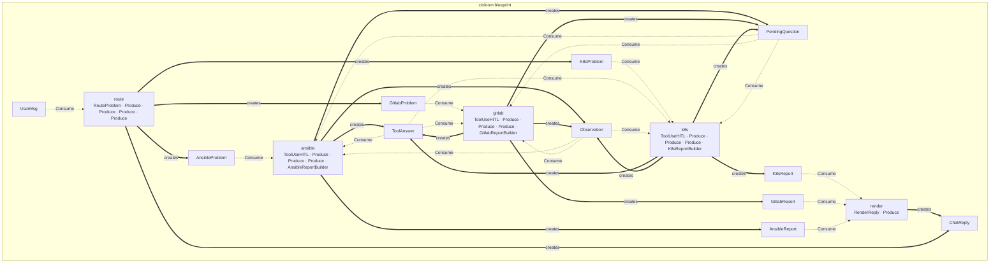

# devops — HITL tool agent (ops assistant)

An ops chat that routes a free-form complaint to a specialist agent (k8s /
GitLab / Ansible), each with its own tool and its own report builder. The
one domain twist: when an agent is mid-investigation and needs a value the
user never gave (a namespace, a project, a role), it asks — `effects.ask(...)`
→ `PendingQuestion` — and the *next* user message resumes that question
instead of starting a new problem (`create_message` in `web.py`/`chat.py`
checks for a pending question first). `HITLLMAgent` + `ToolUseHITL` do the
reactive ask/resume loop; routing itself is a separate structured LLM step
(`StructuredLLM`), not folded into a specialist's own prompt.

## Structure

```
devops/
├── chat.py           # CLI entry (build_resources, terminal loop)
├── web.py            # FastAPI/SSE app + trace dashboard (create_trace_router)
├── models.py         # artifact types (UserMsg, *Problem, *Report, ChatReply)
├── agents.py         # thin containers: RouteAgent, K8sAgent, GitlabAgent,
│                      #   AnsibleAgent (HITLLMAgent), RenderAgent
├── tools.py           # fake tools (kubectl_get, gitlab_search/pipeline,
│                      #   ansible_run) — simulated output, no real systems
├── prompts.py         # per-specialist system prompts
├── produce/
│   ├── router.py      #   UserMsg → the right *Problem (structured routing)
│   ├── reports.py      #   K8s/Gitlab/AnsibleReportBuilder — tool loop → *Report
│   └── reply.py        #   *Report → ChatReply (render step)
└── web/index.html     # UI
```

## Run

```bash
.venv/bin/python examples/devops/web.py     # SSE UI + trace dashboard on :8000
.venv/bin/python examples/devops/chat.py    # interactive CLI
```

Without an LLM key the tool router and specialists fall back to deterministic
demo behavior; with a key (in `.env`) routing and report generation go through
the configured provider — the tools themselves are always simulated (see
`tools.py`'s own docstring: no real Kubernetes/GitLab/Ansible is ever
touched, by design, so the demo is safe to run against nothing).

Try: `pods are crashlooping in prod` — routes to the k8s agent, which asks
for the namespace before calling `kubectl_get` (mandatory tool parameters
are exactly what forces the clarifying question, HITL `type:"ask"`).

## How it flows — no graph to draw

Each agent declares what it `consumes`/`produces`; the runtime derives
execution from state changes. This is the actual static map of this demo's 5
agents (`python -m ctxloom graph examples.devops.agents`):



Each specialist (`k8s`/`gitlab`/`ansible`) consumes its own `*Problem` type
*and* `ToolAnswer`/`Observation`/`PendingQuestion` — the self-consume that
lets `HITLLMAgent`'s reactive ask/resume loop keep running without the
specialist declaring that wiring itself (see `ctxloom/llm_agent.py`).
`render` fans in every `*Report` type into one `ChatReply`; a mandatory tool
parameter that the router never captured is what forces the ask in the first
place, not a manual "if missing, ask" branch anywhere in this demo's own code.

## Trace dashboard

`web.py` mounts `create_trace_router` next to the chat router — every run's
agent spans, tool calls and LLM usage are inspectable at `/traces` without
any external service (see [docs/en/observability.md](../../docs/en/observability.md)).
