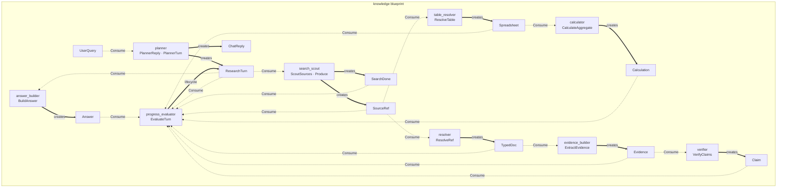
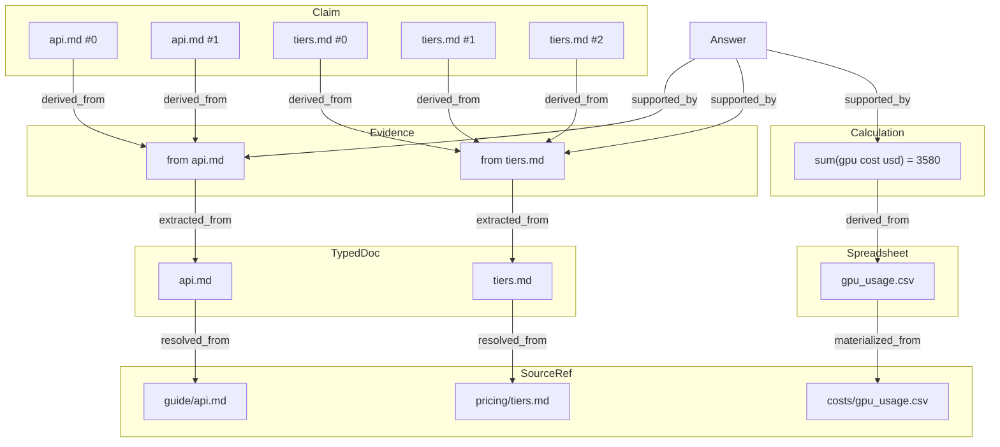

# knowledge — multi-source chat with evidence-backed answers

An English demo that answers questions over local docs (guide/pricing) and a
CSV cost table: search → evidence → claim verification → answer with source and
provenance (§17, §34-§36), plus deterministic calculation over structured data
(§29, §67) and a keyword-triggered skill for reporting that calculation
(§67, `ctxloom.recipes.skills`).

## Structure

```
knowledge/
├── chat.py           # CLI + build_resources (docs + CSV + skills + env LLM)
├── web.py            # thin FastAPI/SSE app (uses chat.build_resources)
├── models.py         # artifact types (Question, Evidence, Claim, Answer, …)
├── agents.py         # thin containers + the shared AGENTS list
├── produce/          # staged pipeline (each Produce is its concern):
│   ├── common.py     #   routing regexes, chat memory, claim/verdict helpers
│   ├── router.py     #   greeting / direct reply vs research
│   ├── search.py     #   fan-out over sources + text/table materialization
│   ├── evidence.py   #   extraction + deterministic claim verification (§35-§36)
│   ├── calc.py       #   CSV aggregation → Calculation (§29, §67)
│   └── lifecycle.py  #   turn overseer + answer builder (loads matched skills)
├── web/index.html    # UI templates
├── docs/             # English documentation fixtures (guide / pricing / costs)
├── skills/           # cost-reporting.md — a Claude-Skills-shaped instruction
└── .env.example      # keys for a real model
```

## Run

```bash
.venv/bin/python examples/knowledge/chat.py
.venv/bin/python examples/knowledge/web.py     # SSE UI on :8000
```

Without an LLM key the demo runs on deterministic fallbacks (§68); with a key
(in `.env`) generation goes through the configured provider.

Try: `how much does gpu cost in total?` — it exercises every stage (text
search, structured-data search, deterministic calculation, verification) in
one turn.

## How it flows — no graph to draw

There is no orchestration to wire up: each agent declares what it
`consumes`/`produces`, and the runtime derives execution from state changes.
This is the actual static map of this demo's 9 agents
(`python -m ctxloom graph examples.knowledge.agents`):



## Provenance for a real question

Ask `how much does gpu cost in total?` and the answer is not a string pulled
from nowhere — every derived artifact links back to what produced it (§34).
Below is the actual relation graph from that run (via
`python -m ctxloom context <sessions-db>`; node ids shortened here for
readability — see [docs/en/viz.md](../../docs/en/viz.md) to render your own):



Every arrow is a real `patch.link` written by the pipeline, not a debugging
add-on — `Answer.sources` and this graph come from the same state.

## Skills — instructions loaded by the situation, not the graph

`skills/cost-reporting.md` is a Claude-Skills-shaped file: a `name`/
`description` frontmatter plus a body of procedural instructions.
`chat.py`'s `build_resources()` loads every file in `skills/` once
(`ctxloom.recipes.load_skills`) into `resources.get("skills")`; `BuildAnswer`
(`produce/lifecycle.py`) only *matches* a skill against the situation when it
has a `Calculation` to report:

```python
skills = context.resources.get("skills") or []
situation = "reporting an answer backed by a number computed from structured storage (a spreadsheet/CSV table)"
for skill in match_skills(skills, situation):
    prompt += f"\n\nInstruction ({skill.name}): {skill.body}"
```

This is the same reactive shape as everything else here: a skill fires
because of *what state exists* (a `Calculation` artifact), not because the
code branches on the user's phrasing. `match_skills` is deterministic keyword
overlap (`ctxloom.recipes.keyword_score`, §67) over the skill's own
description — no embeddings, no new core primitive (§61). See
[docs/en/recipes.md](../../docs/en/recipes.md#skills).